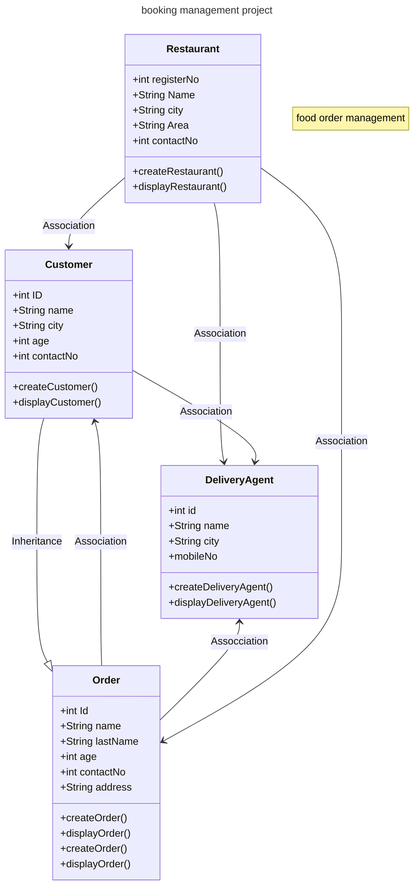

# **Maven Booking Management Project**

Welcome to the **Maven Booking Management Project**, a simple yet powerful Java application that simulates a booking management system. This project uses Object-Oriented Programming (OOP) principles to create a seamless experience for managing customers, delivery agents, orders, and restaurants.

---

## **🚀 Project Overview**

The **maven-booking-management-project** is designed to demonstrate a **booking management system** with a focus on real-world interactions. It allows for easy management of bookings, delivery agent assignments, and order handling.

This project is ideal for learning core Java programming concepts while also providing a hands-on demonstration of how object-oriented systems interact.

---

## **✨ Key Features**

- **Customer and Restaurant Booking Management**: Effortlessly manage customer bookings and restaurant listings.
- **Delivery Agent Simulation**: Assign delivery agents to customer orders based on location and availability.
- **Dynamic Order Handling**: Add, track, and manage customer orders in a real-world-like scenario.
- **Seamless Java Integration**: Uses Java models to represent the various entities involved in the system.
- **Easy-to-Follow Structure**: Simple, intuitive design for learning purposes and demonstration.

---

## **🛠️ Technologies Used**

This project is built with the following technologies:

- **Java**: The core programming language used for developing the application.
- **Maven**: A project management and build automation tool to handle dependencies, building, and packaging.
- **MySQL**: A reliable relational database system used to store customer, restaurant, delivery agent, and order data.

---


## **💡 Installation and Setup**

### **Prerequisites**
Before you begin, ensure you have the following:

- **Java Development Kit (JDK) 21**: Install the latest JDK for optimal performance.
- **Maven**: Make sure Maven is installed to handle the project build.
- **MySQL Database**: You'll need to have MySQL installed and set up to manage your data.
- **IDE**: Use IntelliJ IDEA, Eclipse, or any Java IDE you're comfortable with.
- **Git (optional)**: For version control and easier collaboration.

## **💡Steps to Get Started**

1.## **Clone the Repository**:
   ```bash
   git clone git@github.com:shreyamahalle/maven-booking-management-project.git

   
2. ##** Navigate to the Project Directory:**
- cd maven-booking-management-project

3. ##** Open the Project in Your Preferred IDE:**
- Launch your IDE (IntelliJ, Eclipse, etc.), and open the cloned repository.

4. ##** Set up the MySQL Database:**
- CREATE DATABASE booking_management;
   USE booking_management;


Create a new database for this project in MySQL:
## **Configure Your MySQL Connection:**
- In your project configuration (application.properties), set the MySQL database connection details.
- 


## **Code Structure## **  
## **Packages Structure**
- com.booking.using.dowhile: Contains the main application logic (BookingDemoDoWhile.java).
- com.booking.using.dowhile.model: Includes the model classes:
  - Customer.java
  - DeliveryAgent.java
  - Order.java
  - Restaurant.java
- package names: com.booking.Customer.model
- package names: com.booking.DeliveryAgent.model
- package names: com.booking.Order.model
- package names: com.booking.Restaurant.model
- package names: com.booking.BookingDemoDoWhile.service

## **Functionality**
1. **Customer**
2. **DeliveryAgent**
3. **Order**
4. **Restaurant**

## **🔧 Core Functionality**
1. Customer Management
Allows you to create and manage customer information such as name, username, contact details, and address.

2. Delivery Agent Management
Adds delivery agents, assigns them to orders, and tracks their delivery status.

3. Order Management
Manages the creation, display, and tracking of customer orders from placement to delivery.

4. Restaurant Management
Registers new restaurants, displays restaurant details, and associates them with orders.


## **📝 Database Schema (POJO Classes)**
| **Entity**          | **Attributes** |
|---------------------|----------------------------------------------------------|
| **Customer**           | user id, name, username,monbileNo,city,area |
| **DeliveryAgent**          | id, name, city, mobileNo |
| **Order**         | id, name, city, mobileNo |
| **Restaurant**        |registerNo, name, City, Area |

---


#  Class Diagram

